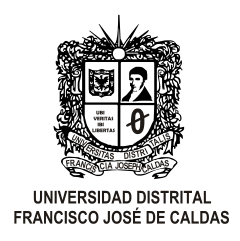

# Universidad Distrital Francisco José de Caldas
## Facultad Ingenieria
### Redes de las Comunicaciones II

### Laboratorio 1
### Proceso encapsulamiento Arquitecturas Red LAN-WAN-LAN

#### Laboratorio desarrolado por :
* Edwar Diaz Ruiz Cód. 20141020004
* Daissi Bibiana Gonzalez Roldan Cód. 20152020108

---

#### Programas y version
* Cisco Packet Tracer - version 7.2

#### Descripcion
laboratorio de montaje de una topologia para el caso aplicado propuesto en la *prueba de entrada* realizada por el docente.
[Descripcion Doc](https://www.overleaf.com/read/wqqxkxftcwmg "Descripcion Latex")
