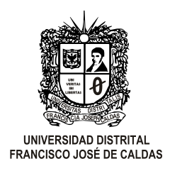

# Universidad Distrital Francisco José de Caldas
## Facultad Ingenieria
### Redes de las Comunicaciones II

### Laboratorio 6
### Laboratorio de Direccionamiento Óptimo con VLSM

#### Laboratorio desarrolado por :
* Edwar Diaz Ruiz Cód. 20141020004
* Daissi Bibiana Gonzalez Roldan Cód. 20152020108

---

#### Programas y version
* Cisco Packet Tracer - version 7.2

#### Descripcion
Laboratorio de montaje de topologias optimizando la division de  para la conexion de diversas subredes haciendo uso de VLSM, en diferentes condiciones expuestas en  *Laboratorio 6 - Direccionamiento Óptimo con VLSM* realizada por el docente.
[Descripcion Doc](https://www.overleaf.com/6726467432xcwjnwqwxtvd "Descripcion Latex")
